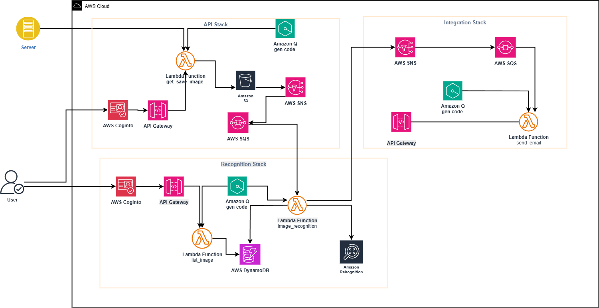

# AWS Image Recognition System

A serverless image recognition system built on AWS that automatically processes uploaded images using Amazon Rekognition, stores results in DynamoDB, and triggers notifications via SNS/SQS.

## 🏗️ Architecture

This system consists of three main components deployed as separate CDK stacks:


### 1. API Stack (`APIStack`)
- **S3 Bucket**: Stores uploaded images
- **API Gateway**: REST API endpoint for image uploads
- **Lambda Function**: Downloads images from URLs and uploads to S3
- **SQS Queue**: Receives notifications when images are uploaded
- **SNS Topic**: Publishes upload events
 - **Cognito User Pool & Client**: Optional authentication for API endpoints

### 2. Recognition Stack (`RekognitionStack`)
- **Lambda Function**: Processes images using Amazon Rekognition
- **DynamoDB Table**: Stores image recognition results
- **API Gateway**: REST API endpoint to list processed images
- **SQS Event Source**: Triggers processing when images are uploaded

### 3. Integration Stack (`IntegrationStack`)
- **Lambda Function**: Sends processed results to third-party endpoints
- **SQS Queue**: Receives processed image notifications
- **SNS Topic**: Publishes recognition completion events

## 🔄 Workflow

1. **Image Upload**: User uploads an image via API Gateway endpoint
2. **S3 Storage**: Image is stored in S3 bucket
3. **Event Trigger**: S3 upload triggers SNS notification to SQS
4. **Image Processing**: Lambda function processes image with Amazon Rekognition
5. **Result Storage**: Recognition results are stored in DynamoDB
6. **Notification**: Completion event is published to SNS
7. **Integration**: Results are sent to third-party endpoint via HTTP POST

## 🚀 Prerequisites

- AWS CLI configured with appropriate permissions
- Python 3.11+
- AWS CDK CLI installed globally
- Node.js (required for CDK)

## 📦 Installation

1. **Clone the repository**:
   ```bash
   git clone <repository-url>
   cd image-recognition-system
   ```

2. **Navigate to the Python directory**:
   ```bash
   cd solution-files-c9/python
   ```

3. **Install dependencies**:
   ```bash
   pip install -r requirements.txt
   pip install -r requirements-dev.txt
   ```

4. **Bootstrap CDK** (if not already done):
   ```bash
   cdk bootstrap
   ```

## 🔐 AWS CLI configuration (run before deployment)

Ensure your AWS CLI is configured so CDK can deploy resources to your account.

1. Verify AWS CLI is installed:
   ```bash
   aws --version
   ```

2. Configure credentials and default region (interactive):
   ```bash
   aws configure
   ```
   - Enter your Access Key ID, Secret Access Key, default region (e.g., `us-east-1`), and output format (e.g., `json`).

   Or configure a named profile:
   ```bash
   aws configure --profile my-profile
   ```

3. Validate your identity:
   ```bash
   aws sts get-caller-identity
   ```

4. (Optional) Use the profile with CDK:
   - Set an environment variable (restart shell after): `setx AWS_PROFILE my-profile`
   - Or pass the profile flag on each command: `cdk deploy --profile my-profile`

## 🛠️ Deployment

1. **Deploy all stacks**:
   ```bash
   cdk deploy --all
   # or with a named profile
   cdk deploy --all --profile my-profile
   ```

2. **Deploy individual stacks** (if needed):
   ```bash
   cdk deploy APIStack --profile my-profile
   cdk deploy IntegrationStack --profile my-profile
   cdk deploy RekognitionStack --profile my-profile
   ```

## 📋 Configuration

### Environment Variables

The system uses the following environment variables:

- `BUCKET_NAME`: S3 bucket name for image storage
- `TABLE_NAME`: DynamoDB table name for storing results
- `SQS_QUEUE_URL`: URL of the SQS queue for image processing
- `TOPIC_ARN`: ARN of the SNS topic for notifications

### AWS Services Configuration

- **Region**: Default region is `us-east-1`
- **Lambda Runtime**: Python 3.11
- **DynamoDB**: On-demand billing
- **SQS**: Standard queue with 30-second visibility timeout

## 🔧 Usage

### Upload an Image

```bash
curl -X GET "https://your-api-gateway-url/?url=https://example.com/image.jpg&name=my-image.jpg"
```

### List Processed Images

```bash
curl -X GET "https://your-list-images-api-gateway-url/"
```

### API Endpoints

1. **Image Upload**: `GET /?url=<image-url>&name=<filename>`
2. **List Images**: `GET /` (returns all processed images from DynamoDB)

## 📊 Monitoring

The system includes CloudWatch logging for all Lambda functions. Monitor:

- Lambda execution logs
- SQS queue metrics
- DynamoDB read/write capacity
- API Gateway request metrics

## 🔒 Security

- IAM roles with least privilege access
- S3 bucket encryption enabled
- DynamoDB encryption at rest
- API Gateway authentication (can be configured)

## 🧪 Testing

1. **Upload a test image**:
   ```bash
   curl -X GET "https://your-api-url/?url=https://picsum.photos/400/300&name=test-image.jpg"
   ```

2. **Check DynamoDB** for recognition results
3. **Monitor CloudWatch logs** for processing status

## 🗂️ Project Structure

```
solution-files-c9/python/
├── app.py                          # Main CDK application
├── cdk.json                        # CDK configuration
├── requirements.txt                # Production dependencies
├── requirements-dev.txt            # Development dependencies
├── api/                           # API Stack
│   ├── infrastructure.py          # CDK infrastructure
│   └── runtime/
│       └── get_save_image.py      # Lambda function
├── recognition/                   # Recognition Stack
│   ├── infrastructure.py          # CDK infrastructure
│   └── runtime/
│       ├── image_recognition.py   # Main processing Lambda
│       └── list_images.py         # List results Lambda
└── integration/                   # Integration Stack
    ├── infrastructure.py          # CDK infrastructure
    └── runtime/
        └── send_email.py          # Integration Lambda
```

## 🚨 Troubleshooting

### Common Issues

1. **CDK Deployment Fails**:
   - Ensure AWS credentials are configured
   - Check IAM permissions for CDK deployment role
   - Verify all dependencies are installed

2. **Lambda Function Errors**:
   - Check CloudWatch logs for detailed error messages
   - Verify environment variables are set correctly
   - Ensure IAM roles have necessary permissions

3. **Image Processing Fails**:
   - Verify image URL is accessible
   - Check S3 bucket permissions
   - Ensure Rekognition service is available in your region

### Debugging

- Enable detailed logging in Lambda functions
- Monitor SQS queue for stuck messages
- Check DynamoDB table for data consistency

## 📈 Scaling

The system is designed to scale automatically:

- **Lambda**: Scales based on SQS queue depth
- **DynamoDB**: On-demand capacity for unpredictable workloads
- **SQS**: Handles message buffering during high load
- **S3**: Unlimited storage capacity

## 🔄 Updates

To update the system:

1. **Modify code** in the appropriate Lambda function
2. **Deploy changes**:
   ```bash
   cdk deploy --all
   ```

## 📄 License

This project is part of an AWS workshop and is provided for educational purposes.

## 🤝 Contributing

1. Fork the repository
2. Create a feature branch
3. Make your changes
4. Test thoroughly
5. Submit a pull request

## 📞 Support

For issues and questions:
- Check CloudWatch logs for detailed error information
- Review AWS service documentation
- Contact your AWS administrator for IAM permission issues
